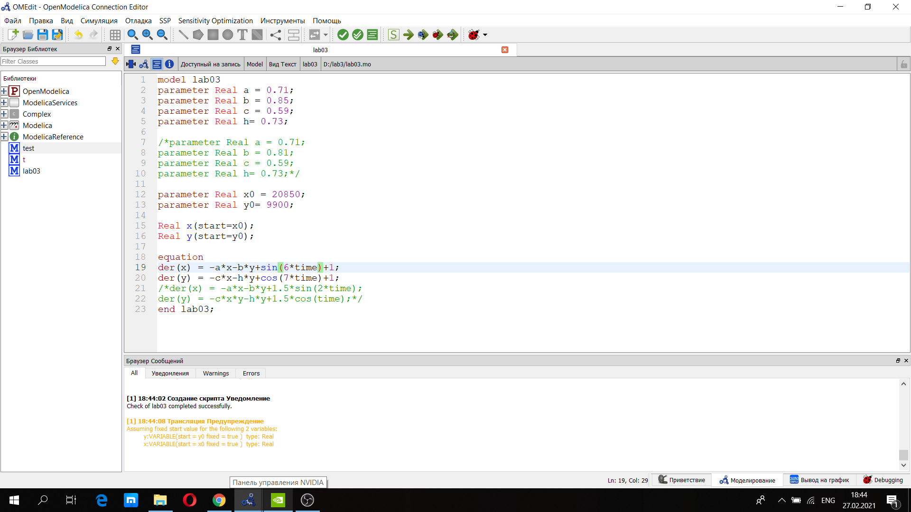
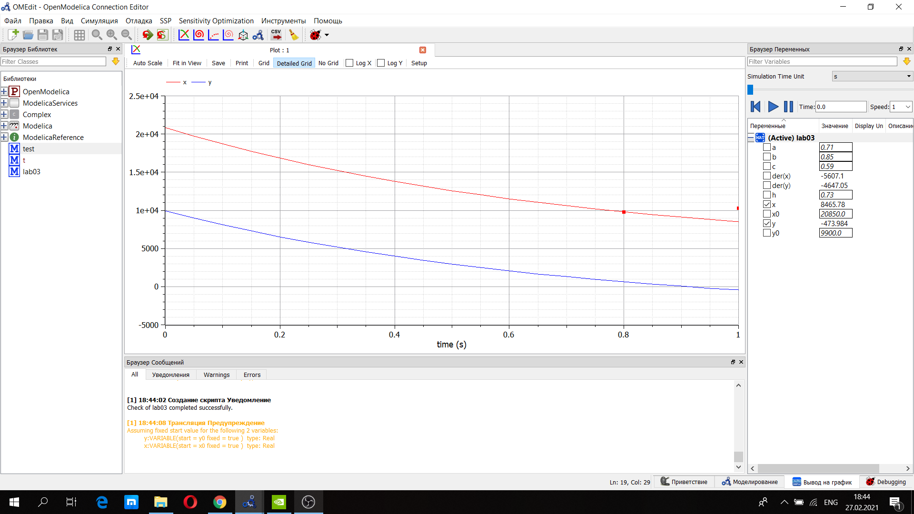
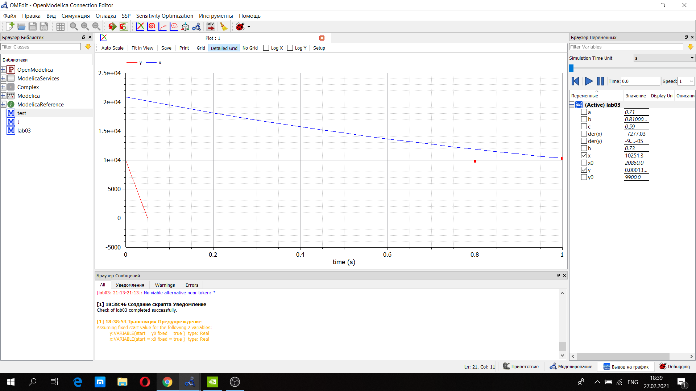

---
# Front matter
lang: ru-RU
title: "Лабораторная работа №3"
author: "Селезнев Василий Александрович"

# Formatting
toc-title: "Содержание"
toc: true # Table of contents
toc_depth: 2
lof: true # List of figures
lot: true # List of tables
fontsize: 12pt
linestretch: 1.5
papersize: a4paper
documentclass: scrreprt
polyglossia-lang: russian
polyglossia-otherlangs: english
mainfont: PT Serif
romanfont: PT Serif
sansfont: PT Sans
monofont: PT Mono
mainfontoptions: Ligatures=TeX
romanfontoptions: Ligatures=TeX
sansfontoptions: Ligatures=TeX,Scale=MatchLowercase
monofontoptions: Scale=MatchLowercase
indent: true
pdf-engine: lualatex
header-includes:
  - \linepenalty=10 # the penalty added to the badness of each line within a paragraph (no associated penalty node) Increasing the value makes tex try to have fewer lines in the paragraph.
  - \interlinepenalty=0 # value of the penalty (node) added after each line of a paragraph.
  - \hyphenpenalty=50 # the penalty for line breaking at an automatically inserted hyphen
  - \exhyphenpenalty=50 # the penalty for line breaking at an explicit hyphen
  - \binoppenalty=700 # the penalty for breaking a line at a binary operator
  - \relpenalty=500 # the penalty for breaking a line at a relation
  - \clubpenalty=150 # extra penalty for breaking after first line of a paragraph
  - \widowpenalty=150 # extra penalty for breaking before last line of a paragraph
  - \displaywidowpenalty=50 # extra penalty for breaking before last line before a display math
  - \brokenpenalty=100 # extra penalty for page breaking after a hyphenated line
  - \predisplaypenalty=10000 # penalty for breaking before a display
  - \postdisplaypenalty=0 # penalty for breaking after a display
  - \floatingpenalty = 20000 # penalty for splitting an insertion (can only be split footnote in standard LaTeX)
  - \raggedbottom # or \flushbottom
  - \usepackage{float} # keep figures where there are in the text
  - \floatplacement{figure}{H} # keep figures where there are in the text
---

# Цель работы

Познакомиться с моделью боевых действий, используя язык программирования Modelica.

# Задание

1. Написать код программы для двух случаев: первый - сражаются две регулярные армии, второй - регулярная и партизанская.
2. Построить график изменения численности войск для первого случая.
3. Построить график изменения численности войск для второго случая.

# Выполнение лабораторной работы
Заданы данные: начальная численность войска X = 20850 человек, а численность войска Y = 9900 человек.
Коэффициенты постоянны и равны для первого случая: a = 0.71, b = 0.85, c = 0.59 и h = 0.73. Для второго случая: a = 0.71, b = 0.81, c = 0.59 и h = 0.73.
Функции подкрепления к войскам X и Y в первом случае: p(t) = sin(6t) + 1 и q(t) = cos(7t) + 1. Во втором случае: p(t) = 1.5*sin(2t) и q(t) = 1.5*cos(t).  

Рассмотрим модель боевых действий  
1. Первый случай (обе армии - регулярные)  

$$\frac{dx}{dt}=-ax(t)-by(t)+sin(6t) + 1 $$
$$\frac{dy}{dt}=-cx(t)-hy(t)+cos(7t) + 1 $$  

С учетом коэффициентов имеем:
$$\frac{dx}{dt}=-0,71x(t)-0,85y(t)+sin(6t)+1 $$
$$\frac{dy}{dt}=-0,59x(t)-0,73y(t)+cos(7t)+1 $$

2. Второй случай (одна армия - регулярная, другая - партизанская)  

$$\frac{dx}{dt}=-ax(t)-by(t)+sin(6t) + 1 $$
$$\frac{dy}{dt}=-cx(t)y(t)-hy(t)+cos(7t) + 1 $$  

С учетом коэффициентов имеем:
$$\frac{dx}{dt}=-0,71x(t)-0,81y(t)+1.5sin(2t) $$
$$\frac{dy}{dt}=-0,59x(t)y(t)-0,73y(t)+1.5cos(t) $$

Ниже представлен скриншот кода программы для двух случаев, написанный на языке программирования Modelica. (рис 1. -@fig:001)  

{ #fig:001 width=70% }  

Представле график для первого случая. (рис 2. -@fig:001)  

{ #fig:001 width=70% }  

Также ниже представле график для второго случая. (рис 3. -@fig:001)  

{ #fig:001 width=70% }    

# Выводы

Я научился строить модель боевых действий на языке программирования Modelica.
